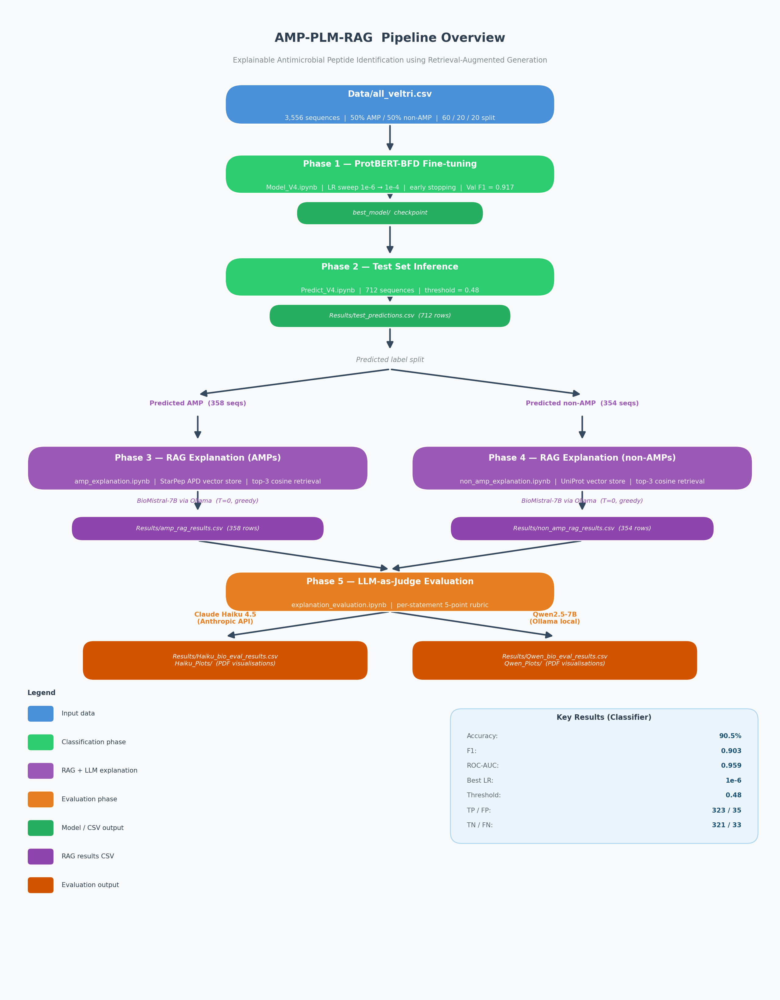

# Explainable Antimicrobial Peptide Identification using Retrieval-Augmented Generation

 

A Master's thesis project (Stockholm University, 2026) that fine-tunes **ProtBERT-BFD** on the Veltri dataset to classify antimicrobial peptides (AMPs), then applies a **Retrieval-Augmented Generation** pipeline with **BioMistral-7B** to produce interpretable biological explanations for each prediction. Explanation quality is evaluated using an **LLM-as-Judge** approach (Claude Haiku / Qwen2.5).

**Author:** Reena Richard

---

## Pipeline Overview



---

## Key Results

| Metric | Value |
|---|---|
| Test Accuracy | 90.5% |
| Test F1 | 0.903 |
| Test ROC-AUC | 0.959 |
| Best learning rate | 1e-6 |
| Optimal threshold | 0.48 |
| True Positives / False Positives | 323 / 35 |
| True Negatives / False Negatives | 321 / 33 |

---

## Repository Structure

```
amp-plm-rag/
├── Model_V4.ipynb                        # Phase 1 — ProtBERT-BFD training
├── Predict_V4.ipynb                      # Phase 2 — Test set inference
├── amp_explanation.ipynb                 # Phase 3 — RAG + explanation (AMPs)
├── non_amp_explanation.ipynb             # Phase 4 — RAG + explanation (non-AMPs)
├── explanation_evaluation.ipynb          # Phase 5 — LLM-as-Judge evaluation
├── Data/
│   ├── all_veltri.csv                    # Training/evaluation dataset (3,556 seqs)
│   ├── StarPep_APD_only.csv              # AMP vector store source
│   └── uniprot_cytoplasmic_metadata.pkl  # Non-AMP retrieval metadata
├── Results/
│   ├── test_predictions.csv
│   ├── amp_rag_results.csv
│   ├── non_amp_rag_results.csv
│   ├── Haiku_bio_eval_results.csv
│   └── Qwen_bio_eval_results.csv
├── Haiku_Plots/                          # Evaluation visualizations (PDF)
├── Qwen_Plots/                           # Evaluation visualizations (PDF)
├── requirements.txt
├── LICENSE
└── CITATION.cff
```

---

## Prerequisites

- Python 3.9+
- CUDA-capable GPU (or Google Colab with GPU runtime) — required for Phase 1 & 2
- [Ollama](https://ollama.com) installed locally — required for Phase 3, 4, and Qwen-based evaluation
- Anthropic API key — optional, for Claude Haiku evaluation judge in Phase 5

---

## Installation

```bash
git clone https://github.com/reenarichard/amp-plm-rag
cd amp-plm-rag
pip install -r requirements.txt
```

Pull the LLM models for the RAG and evaluation phases:

```bash
ollama serve                    # start local LLM server (keep running)
ollama pull biomistral:7b       # ~4 GB — used in Phases 3 & 4
ollama pull qwen2.5:7b          # ~4 GB — optional, for Qwen evaluation judge
```

---

## Running the Pipeline

Run the notebooks **in order**. Each phase depends on outputs from the previous one.

### Phase 1 - Train the classifier

Open `Model_V4.ipynb`. Set a GPU runtime (CUDA recommended). Run all cells.

- Downloads `Rostlab/prot_bert_bfd` from Hugging Face automatically
- Sweeps learning rates from 1e-6 to 1e-4 with early stopping
- Saves the best checkpoint to `best_model/`

### Phase 2 - Test set inference

Open `Predict_V4.ipynb`. Run all cells.

- Loads `best_model/` and runs inference on the held-out test set
- Outputs `Results/test_predictions.csv` (712 rows: sequence, probability, label, TP/FP/TN/FN)

### Phase 3 - RAG explanations for predicted AMPs

Open `amp_explanation.ipynb`. Ensure `ollama serve` is running with `biomistral:7b` available. Run all cells.

- Builds a cosine-similarity vector store from `StarPep_APD_only.csv` using ProtBERT-BFD embeddings (cached after first run)
- For each AMP prediction, retrieves the top-3 most similar known AMPs
- Generates a 6-part biological explanation via BioMistral-7B (temperature=0, deterministic)
- Outputs `Results/amp_rag_results.csv`

### Phase 4 - RAG explanations for predicted non-AMPs

Open `non_amp_explanation.ipynb`. Same Ollama requirements as Phase 3.

- Retrieves top-3 UniProt cytoplasmic protein neighbours for each non-AMP prediction
- Outputs `Results/non_amp_rag_results.csv`

### Phase 5 - Evaluate explanations

Open `explanation_evaluation.ipynb`. Set `JUDGE_BACKEND` at the top of the notebook:

| Backend | Requirement |
|---|---|
| `"anthropic"` | `ANTHROPIC_API_KEY` environment variable set |
| `"ollama"` | `ollama serve` running with `qwen2.5:7b` pulled |

Run all cells to produce per-statement LLM-as-Judge scores. Results saved to `Results/Haiku_bio_eval_results.csv` and `Results/Qwen_bio_eval_results.csv`. Plots saved to `Haiku_Plots/` and `Qwen_Plots/`.

---

## Models and Datasets

| Component | Name | Source |
|---|---|---|
| Classifier backbone | ProtBERT-BFD | [Rostlab/prot_bert_bfd](https://huggingface.co/Rostlab/prot_bert_bfd) |
| Training data | Veltri dataset | `Data/all_veltri.csv` |
| AMP vector store | StarPep APD | `Data/StarPep_APD_only.csv` |
| Non-AMP vector store | UniProt Swiss-Prot | `Data/uniprot_cytoplasmic_metadata.pkl` |
| RAG LLM | BioMistral-7B | `ollama pull biomistral:7b` |
| Evaluation judge | Claude Haiku 4.5 | Anthropic API |
| Evaluation judge (alt) | Qwen2.5-7B | `ollama pull qwen2.5:7b` |

---

## Citation

If you use this repository in academic research, please cite:

```bibtex
@mastersthesis{reenadgj2026,
  author = {Reena Richard, Samyah Ahmadaldeen},
  title = {Explainable Antimicrobial Peptide Identification using Retrieval-Augmented Generation},
  school = {Stockholm University},
  year = {2026}
}
```

---

## License

This project is licensed under the [MIT License](LICENSE).
